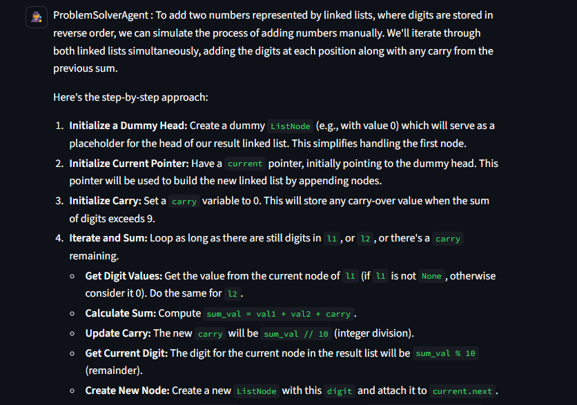

# AlgoGenie - DSA Problem Solver Agentic AI
Its simple AgenticAI application that good at solving DSA problem in python.


### Start up instructions :
```text1. 
1. Need to be install Python3 & Docker
2. Clone it -> cd {folder}
3. create .env file [GOOGLE_API_KEY = {your_key}]
4. python -m venv venv
5. pip install -r requirements.txt
6. streamlit run main.py
```
### Tech Stack Used :
`python3`
`AutoGen`
`gemini`
`docker`

### Preview:


